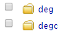
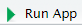
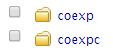

# **Use of circlncRNAnet in local mode**

This instruction will guide the users to use the circlncRNAnet in local mode. To set up a local run mode, the following three items are required:

1. Linux environment.   
2. R, v3.3.2 is recommended.  
3. RStudio.  
 
Then, follow the instructions below for installation and data analyses:
  
<br> 
  
### **1. Installation of prerequisites**  

```
# download circlncRNAnet
git clone https://github.com/smw1414/circlncRNAnet.git
cd  circlncRNAnet

# make all scripts executable  
chmod +x *.[Rr]
chmod +x *.sh

# installation of reguired pakcages for R
R
install.packages(c("shiny","shinyjs","ggplot2","plotly","data.table","DT","visNetwork","googleVis","magrittr","factoextra","plyr","circlize","getopt"))
source("https://bioconductor.org/biocLite.R")
biocLite(c("DESeq2","BiocParallel","org.Hs.eg.db","clusterProfiler"))
q("no")

```
  
<br> 
  
### **2. Download the db files**  

```
wget http://app.cgu.edu.tw/circlnc/db/db.zip # 1GB
# or https://drive.google.com/file/d/1GZTwYKFbeyejiuGdzmt48hMxkDCeucX6/view?usp=sharing
wget http://app.cgu.edu.tw/circlnc/tcga/tcga.zip # 1.6GB
# or https://drive.google.com/file/d/17fEiOTrJb1L-9LrQG8pDxel5rh_Ep-ce/view?usp=sharing
unzip db.zip  
unzip tcga.zip  
```
  
<br> 
  
### **3. Perform the differential expression analysis**
  
#### **Preperation of gene matrix file**
* Please refer http://app.cgu.edu.tw/circlnc/circlnc_tutorial/_book/data-input.html#preparation-of-input-files  
<br>  

#### **Perform the differential expression analysis**

1. Open **RStudio** and create a new **R project** under the folder of **circlncRNAnet**.  
2. Run the following commands for either lncRNA or circRNA differential expression analyses.  

```
# lncRNA  
system("./lncrna_local_run_deg.sh <gene reads count table> <demographic table>")

# circRNA 
system("./circrna_local_run_deg.sh <gene reads count table> <demographic table> <circRNA reads count table>")

# TCGA data 
# Please refer the table below for the available TCGA datasets
system("./lncrna_local_run_deg_tcga.sh <cancer code>")
system("./lncrna_local_run_deg_tcga.sh TCGA-LUAD")

# example of demo datset  
# lncRNA 
system("./lncrna_local_run_deg.sh demo_file/TCGA_COADREAD_GENCODEV25_raw_read_count.txt demo_file/TCGA_COADREAD_GENCODEV25_condition.txt")

# circRNA  
system("./circrna_local_run_deg.sh demo_file/encode_example_Gene_raw_read_count_casted.txt demo_file/encode_example_circRNA_condition.txt demo_file/encode_example_circRNA_raw_read_count_casted.txt ") 
```

|TCGA datasets| | | |  
|----------|----------|---------|---------|  
|TCGA-BLCA |TCGA-ESCA |TCGA-LIHC|TCGA-PRAD|  
|TCGA-BRCA |TCGA-HNSC |TCGA-LUAD|TCGA-READ|  
|TCGA-CESC |TCGA-KICH |TCGA-LUSC|TCGA-STAD|  
|TCGA-CHOL |TCGA-KIRC |TCGA-PAAD|TCGA-THCA|  
|TCGA-COAD |TCGA-KIRP |TCGA-PCPG|TCGA-UCEC|  


<br> 
  
### **4. Visualization of differential expresion results/table** 

1. Open the file browser in the right bottom panel.    

2. Open the **app.R** under the <span style="color:red">deg</span> folder for <span style="color:red">lncRNA</span> or the <span style="color:blue">degc</span> folder for <span style="color:blue">circRNA</span> analysis.   

3. Run the app by clicking **Run App**.   

* Users can browse and select the gene of interest now.  
* The **Calcaulate co-expression** button was designed for the PHP and the Shiny enviroment. Thus, the button is non-functional in this enviroment. To calculate the co-expressed genes, please follow the next step.
  
<br> 
  
### **5. Perform co-expression analysis**  

```
# lncRNA
system("./lncrna_local_run_cor.sh <lncRNAs>")  

# circRNA
system("./circrna_local_run_cor.sh <circRNAs>")

# <lncRNAs/circRNAs> could be one or more genes, seperated by comma.

# example of demo datset
# lncRNA 
system("./lncrna_local_run_cor.sh CCAT1,PVT1")

# circRNA  
system("./circrna_local_run_cor.sh chr11_35204640_35201082_fwd,chr10_97437191_97438703_rev,chr9_128515639_128508876_fwd") 
```
  
<br> 
  
### **6. Visualization of co-expression analysis results**  

1. Open the file browser in the right bottom panel.    

2. Open the **app.R** under the <span style="color:red">coexp</span> folder for <span style="color:red">lncRNA</span> or the <span style="color:blue">coexpc</span> folder for <span style="color:blue">circRNA</span> analysis.   

3. Run the app by clicking **Run App**.  


<br>  
<br>   
<br>  


